# Tutorial 2: Hands-on Radar Sensing and Imaging

**Course:** COM-405  
**Instructor:** Haitham Al Hassanieh - SENS Lab  

---

### Important Note: 
This tutorial includes six tasks, labeled Task 0, ..., Task 5 in this README.
Please inform your assigned TA **each time your group completes a task** so they can record it as completed. 

### Safety Note: 
RF circuitry is fragile and finnicky. Make sure you are holding the boards by the edges, place the boards face up, and not to touch the antennas (pictured below).  

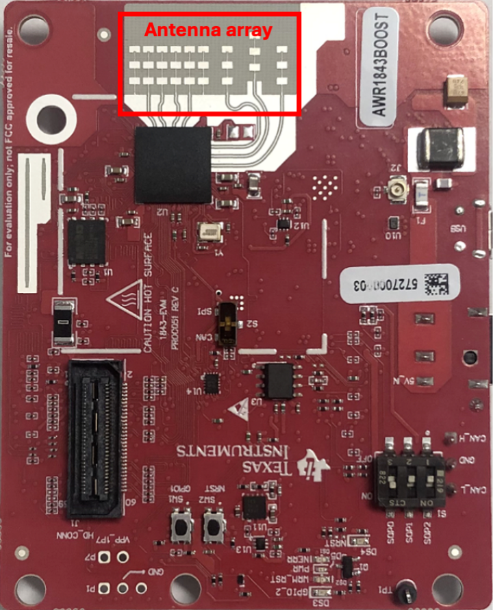
---

## Introduction
In this hands-on session, you will learn how to work with **FMCW** millimeter wave radars from Texas Instruments. They operate at the 77GHz band, have 3 transmitters and 4 receivers and only require a host machine to program and run commands. Unfortunately, the **smoothest** way to operate these is with Windows machines :') (integration with Linux/Mac is coming soon). 

##### Prerequisites:
- basic knowledge of FMCW waveforms and radars that was taught in the lecture
- basic Python knowledge

You are required to work in teams of 3-4 where you have at least one Windows machine to run the radar. You will also need to have 2 USB ports and an Ethernet port. Dongles to USB-C will be provided if necessary.  

The radar setup includes two PCBs:
- **Red radar board (TI XWR1843BOOST):** contains antennas and radar hardware. All waveform configuration and frame settings happen here.  
- **Green raw data streaming board (DCA1000EVM):** streams raw complex samples via Ethernet. Triggers to start collection are sent to this board.  

---

## Table of Contents
- [Task 0: Setup Radar](#task-0-setup-radar)
- [Task 1: Capture Data](#task-1-capture-data)
- [Task 2: Range Estimation](#task-2-range-estimation)
- [Task 3: Tracking](#task-3-tracking)
- [Task 4: Measure your breathing](#task-4-measure-your-breathing)
- [Task 5: Localize around the corner](#task-5-localize-around-the-corner)

---

## Task 0: Setup Radar 
### Software Installation
Follow the steps in the [radar setup document](https://www.overleaf.com/read/htgqnrgtjwsw#fdd1d6) for installing software for the radar.  Once the software is installed and radar is plugged in you can continue with trying to run the radar following the instructions below.
- Estimated setup time: 40 minutes. Notify your TA if it takes longer. 
- If possible you should try to start this installation before the tutorial time as it can take some time.

### Hardware Installation
To begin powering the radar board:
- Plug the 2 micro USB cables and Ethernet cable into your computer
- The **red radar board should be powered with a 5V power supply** and the switch on the DCA1000EVM (green board) should be set to 5V_RADAR_IN (S3) so that the radar board is powering the green board. (Note: you should power the red radar board only with the 5V power supply).
- Plug the micro-USB into the red board 
- Plug the micro-USB into the DCA1000EVM making sure it is in the port `RADAR_FTDI`.

Now you have to configure the network settings:


In order to communicate with the DCA board, you need to change the IP address of the ethernet port. **Your radar needs to be connected to power** in order for the computer to see the radar. 
Then, go to Control Panel **>** Network and Internet **>** Network and Sharing Center **>** Change adapter settings (on the left side of the window) and select your ethernet connection. Then double click on the option IPv4 and change the IP address to (192.168.33.30 / 255.255.255.0) like the image below.

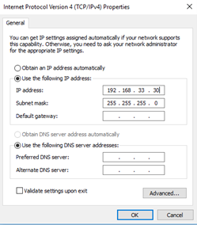

### But first, here is some background information before we dive into trying the radar out:

In FMCW radars, the transmit signal is a single tone with its frequency changing linearly with time. This sweep in frequency is commonly referred to as a *chirp*. A set of these chirps form a *frame* (dictated by how we program the radar, in this tutorial a frame will be 3 chirps; one from each transmitter). The various parameters of the chirp ramp (like frequency slope, sweep bandwidth, and so forth) impact the system performance.

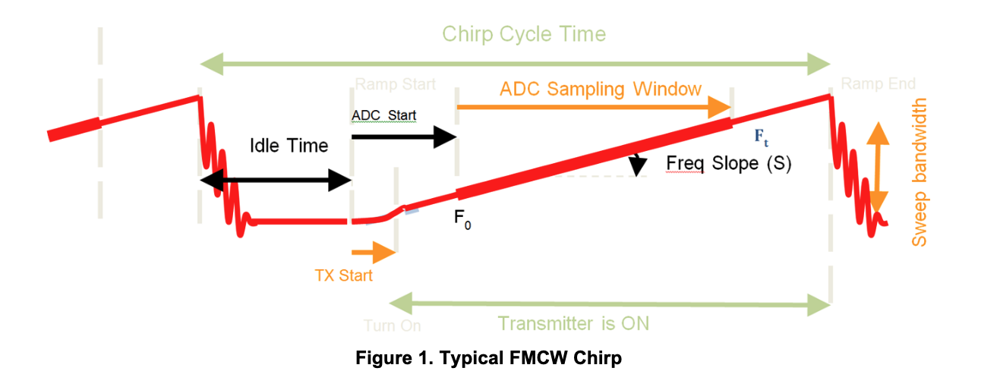

### Now let us actually start capturing data!

There are two ways to capture data:

1. The first and easiest(?) way (which we will not use) is using the **Connection** tab in the RadarAPI window. This requires manually resetting the board, connecting to it, loading various drivers, etc., but you do **not** have to write any Lua.
2. The second way uses **Lua scripts**, which is what this tutorial relies on. This uses mmWave Studio to run Lua files. 

**Lua Files**: These radars use the programming language Lua to set the paramters of the FMCW waveform (in other words: chirp parameters), how many frames to capture, and so on. You don't need to know how to write anything in Lua, as we have provided variables at the tops of each of these files which you can edit. It is important that you do not change the variable *name* at all, since the code reads the variables in order to grab the paramters for post processing (this will always be in the function *utility.read_radar_params*). 

Each of the variables have a description of what the variable represent. Some of the variables, such as `FREQ_SLOPE` and `SAMPLE_RATE` you should be able to relate it back to the lecture. Other variables like `IDLE_TIME` or `RAMP_END_TIME` are variables that are constrained by the slope, sampling rate and number of digital samples you collect (`ADC_SAMPLES`). See figure of the FMCW Chirp for a visualization of the chirp what these variables represent.

The provided Lua code automatically runs all the necessary commands, so there is no need to deal with the mmWave interface directly for running the radar, since the provided Python scripts run everything. You just **need to turn on mmWave Studio in the background**. If you do not want to use Python to run the configuration scripts, you can also just hit **Run** at the bottom of the mmWave Studio GUI. 

**Tip:** When mmWave Studio opens it does **not** automatically show the *Output* tab, which tells you whether your scripts are running successfully or failing. Go to the top left: **View → Output** to enable it. Then, when you run any of the Python scripts you can see in the Output window if there are any errors relating to mmWave Studio setup.
It is also useful to look through the RadarAPI tab in mmWave Studio (which should automatically open). Inside this window, the **RampTimingCalculator** tab will be **very** useful for Task 2.

#### 9 files are given:
- [scripts/1843_config_lowres.lua](scripts/1843_config_lowres.lua) formats the radar waveform on the board for task 1 low resolution.
- [scripts/1843_config_highres.lua](scripts/1843_config_highres.lua) formats the radar waveform on the board for task 1 high resolution.
- [scripts/1843_config_lowrange.lua](scripts/1843_config_lowrange.lua) formats the radar waveform on the board for task 1 short range.
- [scripts/1843_config_highrange.lua](scripts/1843_config_highrange.lua) formats the radar waveform on the board for task 1 long resolution.
- [scripts/1843_record.lua](scripts/1843_scripts.lua) is used to capture data for task 1 and 2.
- [scripts/1843_config_debug_task3.lua](scripts/1843_config_debug_task3.lua) is used to configure and capture 1000 frames for debugging task 3.
- [scripts/1843_config_debug_task4.lua](scripts/1843_config_debug_task4.lua) is used to configure and capture 20000 frames for debugging task 4.
- [scripts/1843_config_streaming_task3.lua](scripts/1843_config_streaming_task3.lua) is used to configure and continously capture data for task 3.
- [scripts/1843_config_streaming_task4.lua](scripts/1843_config_streaming_task4.lua) is used to configure and continously capture data for task 4.


**Deliverables** 
Show the TA the radar correctly plugged in and set up.

---

## Task 1: Capture Data

1. **Run mmWave Studio**  
   Path (default installation): `C:\ti\mmwave_studio_02_00_00_02\mmWaveStudio\RunTime\mmWaveStudio.exe`
   Run it in *Administrator Mode*.

2. **Open Device Manager**  
Check that the correct ports appear. This is found under the XDS110 section in Device Manager.  
If you do not see it, enable:  View → Show hidden devices

Example:
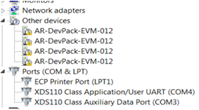

Check and make sure that 4 ports ending in EVM-012 appear and 2 ports labeled Application/User and Data Port appear.

3. **Ensure file paths are correct**  
If you installation of mmWave Studio is in the path:
`C:\ti\mmwave_studio_02_01_01_00\`.
Then you can move onto step 4.

Otherwise, you need to update the following files:
The follow Lua files on lines 5,6 update the paths of `RADARSS_PATH` and `MASTERSS_PATH` to be correct:
- [scripts/1843_config.lua](scripts/1843_config.lua) 
- [scripts/1843_config_debug_task3.lua](scripts/1843_config_debug_task3.lua) 
- [scripts/1843_config_debug_task4.lua](scripts/1843_config_debug_task4.lua) 
- [scripts/1843_config_streaming_task3.lua](scripts/1843_config_streaming_task3.lua) 
- [scripts/1843_config_streaming_task4.lua](scripts/1843_config_streaming_task4.lua) 
 
And in the function [utils/radar.py](utils/radar.py) on line 45:
- `self.rtt_path = (Put the correct path here) `

4. **Return to the repository to capture data**  
We recommend you place the radar similar to the image below where it is standing up so that the antennas are facing you:

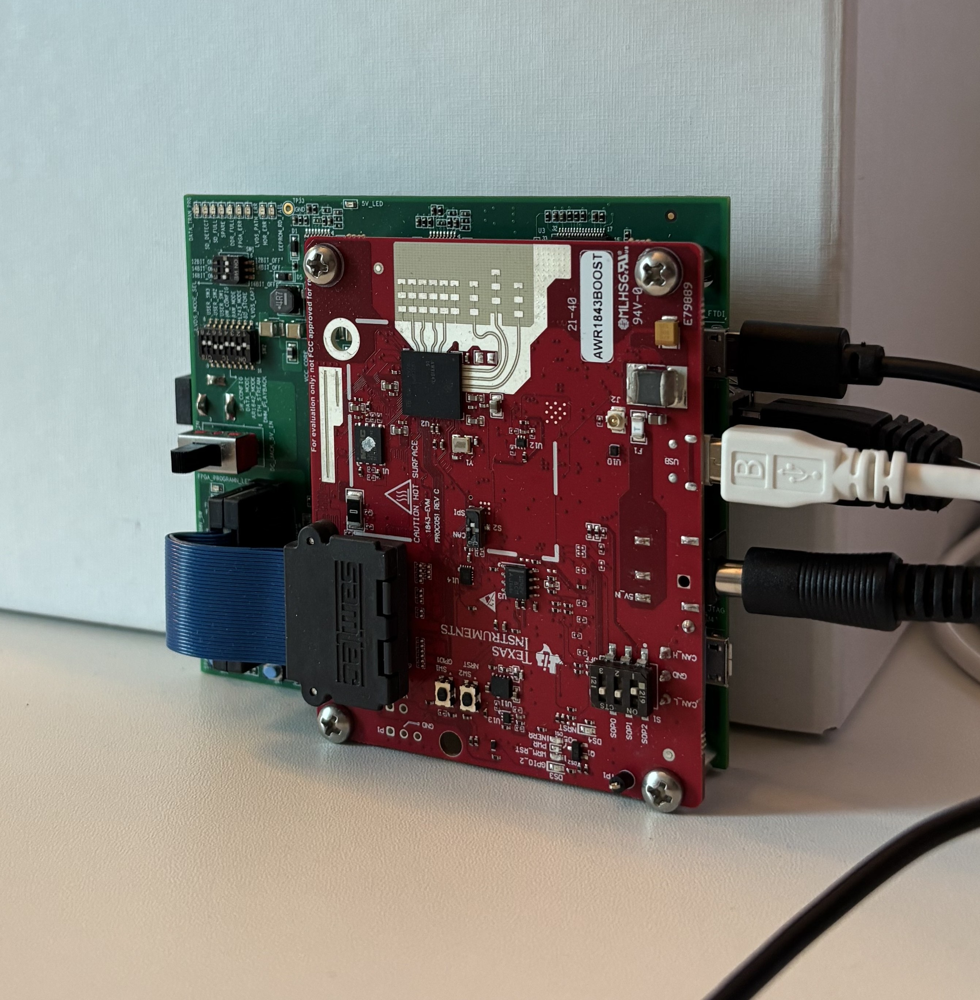 

Make sure mmWave studio is open, and for all of the parts moving forward, you **need mmWave Studio to be open in the background** since Python is calling Lua scripts to be run in mmWave Studio. For realtime code in tasks 3, 4, 5, there are more instructions on what needs to be done regarding mmWave Studio.

Run in whichever Terminal you have your python environment (if you are not sure and installed Anaconda, we recommend using Anaconda Prompt):
```bash
python configure.py
```
This reads the correct COM port to communicate with the radar and updates your Lua files accordingly.

Now run:
```bash 
python task1_capture.py --config scripts/1843_config_lowres --exp_name test
```
Make sure to use the flag: `--config` with the corresponding configuration script (no `.lua` at the end) the first time and each time you want to change the FMCW chirp parameters. This flag runs the Lua configuration file. Otherwise if you are just capturing more data but not changing the chirp parameters you can remove the flag. `--exp_name` will give the experiment the name you indicate and save it into `data` as `{exp_name}_Raw_0.bin`.

As long as you are running the code from the project directory and the Lua scripts are in `scripts` then you should not have to modify anything in [task1_capture.py](task1_capture.py).  
The script essentially runs the configuration file you give it, and then records data with [scripts/1843_record.lua](scripts/1843_record.lua).

Once you run the first task, it will take some time to configure the board and capture data. You should return to mmWave Studio and check that the Output Tab does not give you any errors. You will also see each command as its being run. Once it has sucessfully captured data you should see something like this in your output:

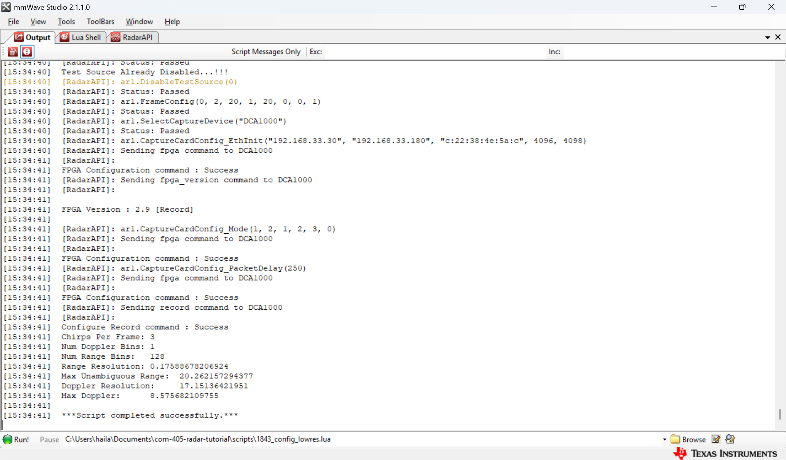

Make sure you are able to capture data in the folder `data` and the file `{exp_name}_Raw_0.bin` exists. 
If you do run into errors in the Ouput tab of mmWave Studio, there are some common fixes:
- Check that ALL your firewalls are turned off. 
- Check that the ethernet port is set to `192.168.33.30`.
- Check that you connected the micro-USB cable to the red board and a micro-USB cable to the green boards `RADAR_FTDI`.
- Check that the ethernet cable is plugged in.
- Check that the 5V power is connected to the red board. 

If any of these are wrong, fix it and power cycle the board (turn it off and on) and restart mmWave Studio. 
If none of these are wrong, still power cycle the board and restart mmWave Studio. *If it still doesn't work after this, call a TA over to help you debug.* 

5. **Verify acquisition and locate saved data**  
When working, a green LED on the corner of the DCA board will blink (maybe very briefly if capturing only a few frames).  
Data is saved to the path specified via (this path is updated by the python scripts):
```lua
ar1.CaptureCardConfig_StartRecord(SAVE_DATA_PATH, 1)
```
The data is stored as a binary file, which you must post-process to extract the raw ADC data for further signal processing. Double check that a `*.bin` file is saved in your data folder.


**Deliverables** 
Show the TA the data successfully captured.

---
For all Tasks moving forward, there is a corresponding python script. The general outline is in the README.md, but see each python script for more details on where to edit.

## Task 2: Range Estimation 
Goal: capture experiments demonstrating radar's range estimation ability and explore how chirp parameters affect data. 

**Instructions:**  
1. **Write range estimation code** - write the code required to take the raw data samples from the radar and calculating the (Range FFT), indicated by **TODO** at the top of [task2_ranging_TODO.py](task2_ranging_TODO.py). Note: the output of the radar is already after mixing the received signal with a copy of the transmitted signal so there is no need to do that.
2. **Run a basic experiment** - capture data where you place two reflectors in front of the radar about 10cm away from each other. You can use your hands, or laptops or anything that will reflect signals back to the radar. Making sure mmWave Studio is open whenever you are capturing data, you can use the command:
```bash
python task1_capture.py --config scripts/1843_config_lowres --exp_name lowres
```

Then process the data with [task2_ranging_TODO.py](task2_ranging_TODO.py):
```bash 
python task2_ranging_TODO.py --config scripts/1843_config_lowres --exp_name lowres
```
This takes the chirp configs from [scripts/1843_config_lowres.lua](scripts/1843_config_lowres.lua) and the experiment named `lowres_Raw_0.bin` and processes it with the range FFT and plots it. You should see one peak around the location of the two reflectors you have. This is because the range resolution of this configuration is aroun 17.5cm. 

2. **Change range resolution** – adjust the radar configuration (namely IDLE_TIME, ADC_START_TIME, FREQ_SLOPE, ADC_SAMPLES, SAMPLE_RATE) in [scripts/1843_config_highres.lua](scripts/1843_config_highres.lua) to show how the parameters can resolve the same two reflectors 10cm apart, in other words you want to change the *range resolution*. (Refer to the lecture on how different chirp parameters affect the range resolution or take a look at [chirp parameters document](https://www.ti.com/lit/an/swra553a/swra553a.pdf?ts=1715668268824&ref_url=https%253A%252F%252Fdev.ti.com%252F) prepared by TI (section 2.1).)

    In order to correctly program the radars, you can change the Slope, ADC Samples and Sample Rate, but it also affects the Idle Time, ADC Start Time (time to start sampling) and the Ramp End Time. Which are denoted in the FMCW chirp figure and the image below. So you should use the Ramp Timing Calculator in mmWave Studio RadarAPI to set the Slope, ADC Samples and Sample Rate that you want, and then calculate the 99% Setting for Idle Time, ADC Start Time and Ramp End Time which you will also need to update in the Lua file. Note that the radar is limited to 4GHz bandwidth, and the Slope, ADC Samples and Sample Rate all have minimum and maximum values, so some settings might not work.

    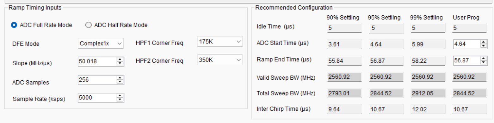

    Since the given chirp parameters already has a range resolution of ~17cm, you should try to create a new configuration that has a smaller range resolution so that two reflectors 10cm away are merged.

    Then you can run:
    ```bash
    python task1_capture.py --config scripts/1843_config_highres --exp_name highres
    ```

    Then process the data with [task2_ranging_TODO.py](task2_ranging_TODO.py):
    ```bash 
    python task2_ranging_TODO.py --config scripts/1843_config_highres --exp_name highres
    ```
    And see if you notice the difference.

3. **Change max range** – adjust the radar configuration to see the effect that changing the *maximum range* on the heatmap. Change the parameters in [scripts/1843_config_highrange.lua](scripts/1843_config_highrange.lua) to create a configuration that captures the wall opposite you. And also change the parameters in the file [scripts/1843_config_lowrange.lua](scripts/1843_config_lowrange.lua) to create a configuration that either does not capture the wall opposite you or visibly shows the difference in maximum range. You can capture data and process data in the same way as for 2 above.

<!-- Tip: You may consult the [chirp parameters document](https://www.ti.com/lit/an/swra553a/swra553a.pdf?ts=1715668268824&ref_url=https%253A%252F%252Fdev.ti.com%252F) prepared by TI (section 2.1) or the lecture slides for understanding how the different parameters affect the radar's range estimation abilities.  -->

<!-- **Running the code**
You should capture data using the task1 file and creating new Lua Files for the 3 other radar configurations you use. 
You can then run the task 2 script as:
```bash 
python task2_ranging_TODO.py
```
Which will load the captured data, and you need to add the code to process the range FFT.
You will have to change the name of the experiment file that you captured previously. -->

<!-- Note: You might want to make a new Lua config file (eg. scripts/1843_config.lua) for each new chirp parameter and keep track of *which* data corresponds to which Lua file for post processing. So that you can show the TA the change in chirp parameters. -->

Hint: The configuration Lua File always prints specs about the waveform at the end (range resolution, max depth, etc.) and you should also use the **RampTimingCalculator** in the RadarAPI in mmWave Studio.

**Deliverables** 
Show the following to your TA:
1. 2 plots showing how the range resolution helps resolve two reflectors
2. 2 plots showing how changing the max range affects the range plot

<!-- **Discussion questions:**  
Make sure to discuss the following with your TA:
- What chirp parameters did you set/modify to affect range resolution and maximum range?   -->

---
### Note: 
For the tasks moving forward, there is a real-time version and a non-real-time version. For **task 3 and task 4**, you are given debugging data and ground truth plots to help with writing your functions (described in more detail in each task). The goal for these two tasks is to run the real-time version of the code. 
<!-- However, as there are many moving parts, we recommend doing the following:
1. Get your code to match the ground truth plots (located in debug_data or this README) using the debugging data (also in debug_data).
2. (For task 4) Capture your own data using the task1-capture (make sure you use the correct configuration file, as we provide both a debug version and real-time version for each task moving foward), and get a similar plot with your own data. 
3. Run the real-time code!   -->

<!-- For **task 5**, the code base is the same as task 3, thus it is a **requirement that task 3 works.** -->

For all of these tasks it is imortant you do not change the input/outputs of each function, this is because the real-time code uses the same functions you write and are expecting specific things. 

---

## Task 3: Tracking 
Goal: perform human heatmap plotting using CFAR ([Constant False Alarm Rate](https://www.radartutorial.eu/01.basics/False%20Alarm%20Rate.en.html)) and angle-of-arrival estimation (aka beamforming or algorithm 1 in the lecture). 
CFAR is generally used for target detection in cluttered scenes by threshold the signal to find local maximas.
The algorithm for CFAR is implemented for you, but you need to finish implementing 2D beamforming.

**Instructions:**  
1. **Complete the beamforming code** - for the function *beamform_2d()* indicated by **TODO** in [task3_tracking_TODO.py](task3_tracking_TODO.py). Here you will just be performing beamforming for a bird-eye-view plot, meaning you only need to calculate azimuth (horizontal) angles by the range (depth).  
    The equation for calculating the steering vector for each angle and antenna (same as Algorithm 1 in lecture 8, but note the sign difference, in this lab you will use a positive phase in the steering vector) is:
    
      <p align="center" style="background:white; padding:10px; display:inline-block;">
        
      </p>


    Where `d_n` is the location of antenna `n`, `phi` is the angle you are calculating, and $\lambda$ is the wavelength at 77GHz.  The antenna locations are given in `x_locs`, wavelength is given by `lm` and the angle is given as `phi` in the code.
    And as in lecture 8, algorithm 1 you will be doing the following (you will just need to implement calculating $h_{\phi}$):
      1) Mix the RX signal with TX. (Already done by the radar itself)  
      2) Compute Range FFT. (Done in the debug and real-time code for you already)  
      3) Multiply the resulting signal on each antenna with **$h_{\phi}$** and sum the signals. (Partially implemented for you)
      4) Repeat in every direction. (Implemented for you in task4_tracking_TODO) 

      Once you have completed the beamforming code, you want to begin with running the script as so:
      ```bash 
      python task3_tracking_TODO.py --exp_name task3_gt
      ```
      Once your plots output from this match the debug video provided for task3 (in `debug_imgs`), then you can move onto the real-time script.  

2. **Run the code in real-time** - 

    For real time processing (make sure mmWave Studio is open), begin by running (if you have an error in plotting, **you might have to run your terminal (whichever terminal you are using) separately in admin mode and run from there**): 
    ```bash 
    python task3_tracking_realtime.py --config
    ```
    Once you have run task 3 with `--config` the first time, you can run it without `--config` since the radar is continously running for this section.
    This should plot your heatmap in real time! 

    ##### <span style="color:red">Important once you run realtime code!</span> Once your radar is running (aka after it has started recording and the LED is blinking), it is (unfortunately) important to **shut down mmWave Studio**, and then go to Task Manager and **shut down the task starting with DCA1000**. See the image below. This is because otherwise too many processes are reading from the same port and it stops transmitting.

    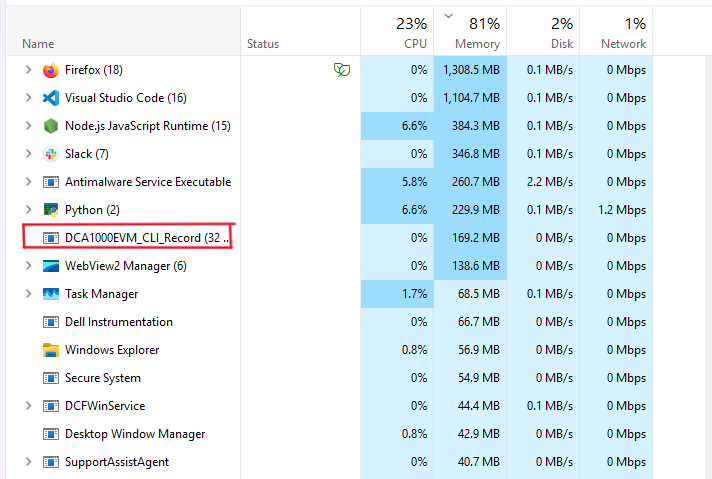 

3. **Play around with CFAR** - Try with and without CFAR implemented and notice the difference in the heatmaps generated. Include the flag `--cfar` in the argument list to implement CFAR on the beamformed output. If you include it, it runs CFAR on the output of the beamforming otherwise if you do not include it, it just returns the beamformed output. 
    Without stopping the radar, just rerun:
    ```bash 
    python task3_tracking_realtime.py --cfar
    ```

**Deliverables**
Show the following to your TA: 
1. Demonstrate **heatmap showing reflectors moving** to your TA. Point out the points that correspond to the human subjects and any other reflectors in the scene that are showing up. 
2. Show both using and not using CFAR and discuss the differences.

Note: If needed, you can ask the TA for corner reflectors which will reflect a lot of RF signal back to the radar.

---

## Task 4: Measure your breathing 
Goal: track breathing and heart rate! 

**Instructions:**  
1. **Complete the phase extraction code** - to detect small motions from breathing/heartrate, indicated by **TODO** in [task4_vital_signs_TODO.py](task4_vital_signs_TODO.py). 
The following steps are done to extract heart rate and breathing rates (in bold is what you need to complete):
    1. The signal is processed over many frames, and first the location of the reflector in question is found from the range FFT. 
    2. **The phase at the location found above is unwrapped over time. This shows the relative distance the object is from the radar.**
          - For **phase extraction** you need to *extract the phase (using `np.angle`) from that range bin*, and look at this *phase over multiple frames* (in this code look at the phase over all the frames given). After that do not forget to unwrap the phase using `np.unwrap`. 
          - Then make sure to convert from phase to distance. Remember that the phase is defined and related to the distance as such:
              ```math 
              \varphi(t) = 2 \pi \frac{d(t)}{\lambda}
              ```

    3. We calculate the frequencies present in the signal (FFT).

    Once you have finished the code run:
    ```bash 
    python task4_vital_signs_TODO.py --exp_name task4_gt
    ```
    The ground truth plots from the debug data should look something like this. 
    <table>
    <tr>
      <td style="text-align:center">
        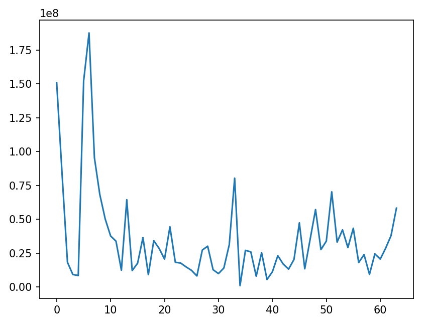<br>
        <b>Range FFT</b>
      </td>
      <td style="text-align:center">
        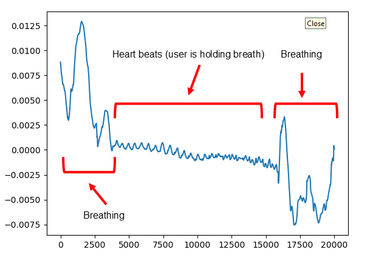<br>
        <b>Phase Over Time</b>
      </td>
      <td style="text-align:center">
        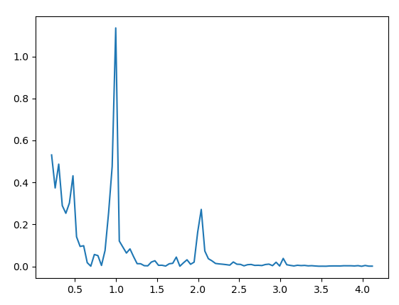<br>
        <b>Cropped at Heart Rate FFT</b>
      </td> 
    </tr>
    </table>
    And if you crop the phase signal as indicated by the TODO in the debug file, you should clearly get around 59 bpm for the estimated heart rate (right most figure).

    Once your plots output from this match the debug images for task4, then you should first capture a non-realtime experiment.
2. **Capture an experiment for heartrate and breathing monitoring**:
      To run this experiment you will make sure mmWave Studio is open, then run [task1_capture.py](task1_capture.py) again but using the configuration file [scripts\1843_config_debug_task4.lua](scripts\1843_config_debug_task4.lua) and changing the experiment name.
      ```bash
      python task1_capture.py --config scripts/1843_config_debug_task4 --exp_name task4_student
      ```
      1) Sit in front of the radar (within a meter) and try to stay relatively still. (at the same time use the pulse oximeter to measure a ground truth heartbeat)
      2) Breath normally for a couple seconds, then hold your breath for a couple seconds, and repeat this process until the radar is finished capturing (the blinking light on the green board will stop and mmWave studio will complete successfully).
      3) Finally, process the data with [task4_vital_signs_TODO.py](task4_vital_signs_TODO.py) making sure to update the names to the experiment you just ran by running:
      ```bash
      python task4_vital_signs_TODO.py --config scripts/1843_config_debug_task4 --exp_name task4_student
      ```              
      4) Compare measured frequency with manually measured breathing rate. 

3. Finally, you can **play around with the real-time script**. 
Make sure mmWave Studio is open, and begin by running: 
```bash 
python task4_vital_signs_realtime.py --config
```

Or if your radar is already running you can run it without `--config`.
This should plot your range plot, phase plot, and frequency extraction in real time!  

##### <span style="color:red">Important once you run realtime code!</span> Once your radar is running, it is (again unfortunately) important to **shut down mmWave Studio**, and then go to Task Manager and **shut down the task starting with DCA1000**. See task 3 for image of Task Manager. 

The following plots will pop up:
1) range FFT, and a dot on the peak that the code is extracting the phase from
2) the phase extraction over time
3) FFT on the phase extraction data (This last plot is a little finicky in real time, so don't pay too much attention to it)

You can observe how the center plot shows changes as you breath or hold your breath.

<!--  
1) sit in front of the radar (within a meter) and try to stay relatively still. The left most plot will show the range FFT and highlight the location where the maximum reflection is (it is filtered within one meter) and where the phase extraction should be happening. 
2) Breath normally and in the center plot should output the phase over time (it will accumulate the frames captured as time goes on), which should correspond to your breathing. This is basically your distance from the radar over time. If you hold your breath, you should see much smaller faster periodic peaks which will correspond to your heart rate!
3) Finally the last plot (might be finicky) is the frequency extraction from the center plot. You should visualize the frequencies present in the phase's signal and the peaks should correspond to the breathing rate and heart rate.  -->

**Deliverables**
Show the following to your TA:  
1. Demonstrate the **breathing and heart rate frequency** plots in from your experiment to the TA. 
2. Discuss the accuracy of measuring breathing rate/heart rate to a pulse oximeter measurement (assuming the smart watch is ground truth).

---

## Task 5: Localize around the corner
Goal: perform around-the-corner localization.  
The fun thing about wireless signals is not only that they can pass through occlusions, but they can also reflect off of surfaces! This means, if you are near a corner, you can reflect the signals off of something like the wall, and see things around the corner :o. 

For occlusions, you will most likely see the occlusion, but also reflectors behind that occlusion (depending on the material of the occlusion you might not even see it very well).

For simple reflections like if your wireless signal reflects off of a wall or *planar surface* then if you process the received signal as usual (meaning you don't assume there is just normal reflectinos in the scene), there will be a *reflected version* of the object that is around the corner. If we were to process the scene assuming there is a reflector at the correct location then the object will appear in the correct location again, but we will not do that in this tutorial.

In this task, you will reuse your code from task 3 (birds eye view heatmap) and see if you can localize things behind an occlusion and around the corner!

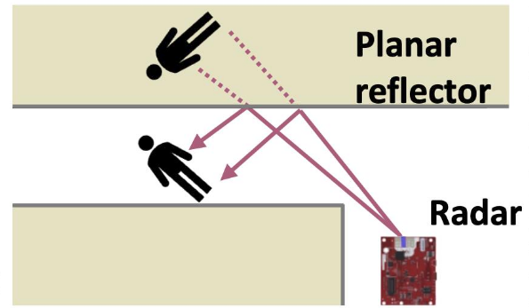 

**Instructions:**  
1. Run a experiment at the 2 non-line-of-sight set ups.

**Deliverables**
1. Observe the effect of reflections and signal path on localization accuracy and discuss with the TA how the reflections show up in your heatmap.

<!-- **Discussion questions:**  
- How does the reflected path affect detection compared to direct line-of-sight?  
- How you estimate the reflected distance to hidden targets?  -->
